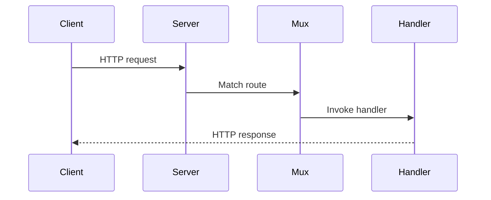

# CH-01: `net/http` for HTTP Server and Client Basics

## 1. Tahap 1: Source Alignment dan Judul

- **Source Link**: [net/http package](https://pkg.go.dev/net/http)
- **Framing**: `net/http` adalah salah satu kekuatan practical Go karena server dan client HTTP dasar sudah tersedia langsung di standard library tanpa perlu framework tambahan.

## 2. Tahap 2: Konsep dan Rasionalitas

### Definisi
Paket `net/http` menyediakan tipe dan fungsi untuk membangun server HTTP, menangani request masuk, dan mengirim request keluar sebagai client. Di sinilah pembaca mulai melihat bagaimana standard library Go mendukung web API secara langsung.

### Rasionalitas
Topik ini penting karena:

1. **Server dan client berbagi model yang konsisten**  
   Request, response, header, dan body dibawa dalam abstraksi yang saling terhubung.
2. **Handler model di Go cukup sederhana dan kuat**  
   Fungsi biasa bisa menjadi entry point untuk endpoint HTTP.
3. **Boundary standard library tetap jelas**  
   Banyak kebutuhan web dasar sebenarnya sudah bisa dilayani tanpa framework tambahan.

### Analogi Model Mental
Bayangkan restoran kecil yang sudah punya meja kasir dan kurir internal. Satu sisi menerima pesanan dari pelanggan, sisi lain bisa juga memesan bahan ke luar. `net/http` menangani dua arah aliran itu dengan kontrak yang sejenis.

### Terminologi Teknis
- **Handler**: fungsi yang menerima request dan menulis response.
- **ServeMux**: multiplexer yang memetakan path ke handler.
- **HTTP Client**: objek yang mengirim request keluar dan menerima response.

## 3. Tahap 3: Visualisasi Sistem

## 4. Tahap 4: Mekanisme Pembuktian

Di sisi server, `http.HandleFunc` atau `ServeMux` menghubungkan path ke fungsi handler. Di sisi client, `http.Client` mengirim request dan menerima response yang body-nya harus ditutup setelah dipakai. Keduanya berbagi model HTTP yang sama, sehingga pembaca bisa melihat Go web stack sebagai satu ekosistem yang konsisten.

Nilai praktisnya:
- cocok untuk API kecil sampai service internal yang tidak butuh banyak lapisan tambahan;
- membantu pembaca memahami pola dasar request-response tanpa distraksi framework;
- menjadi fondasi untuk topik lanjutan seperti timeout, transport, dan middleware di rak lain.

## 5. Tahap 5: Lab Praktis

Lihat pembuktian di folder [examples/](./examples):
- [01_simple_api_server.go](./examples/01_simple_api_server.go) - Handler sederhana yang mengembalikan JSON response.
- [02_http_client_post.go](./examples/02_http_client_post.go) - Client POST sederhana yang berbicara ke server lokal berbasis standard library.

---
*Status: [x] Complete*
