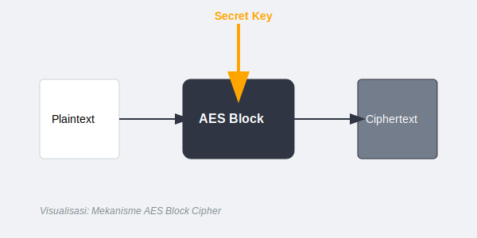
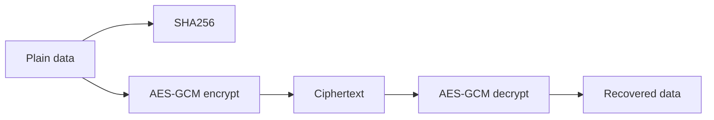

# CH-01: `crypto` for Hashing and Encryption Basics

## 1. Tahap 1: Source Alignment dan Judul

- **Source Link**: [crypto package](https://pkg.go.dev/crypto) | [crypto/aes](https://pkg.go.dev/crypto/aes) | [crypto/sha256](https://pkg.go.dev/crypto/sha256)
- **Framing**: Topik keamanan di `RAK-05` bukan soal teori kriptografi berat, tetapi tentang memahami alat bawaan Go yang paling sering dipakai untuk menjaga integritas dan kerahasiaan data.

## 2. Tahap 2: Konsep dan Rasionalitas

### Definisi
Keluarga package `crypto/*` menyediakan primitive keamanan seperti hashing, random source yang aman, dan enkripsi. Di chapter ini fokus utamanya adalah membedakan hashing dari enkripsi simetris dan memahami kapan masing-masing dipakai.

### Rasionalitas
Topik ini penting karena:

1. **Integrity dan confidentiality adalah dua tujuan berbeda**  
   Hashing memeriksa perubahan data, sementara enkripsi menyembunyikan isi data.
2. **Standard library sudah memberi primitive yang layak dipakai**  
   Engineer tidak perlu membangun algoritma sendiri dari nol.
3. **Pemilihan source randomness sangat krusial**  
   Package keamanan memakai `crypto/rand`, bukan `math/rand`.

### Analogi Model Mental
Hashing mirip segel anti-rusak pada paket. Jika segelnya berubah, kita tahu paket pernah dibuka. Enkripsi lebih mirip brankas yang mengunci isi paket agar tidak bisa dibaca tanpa kunci.

### Terminologi Teknis
- **Hashing**: menghasilkan fingerprint tetap dari input.
- **Symmetric Encryption**: enkripsi dan dekripsi memakai kunci yang sama.
- **Cryptographically Secure Randomness**: sumber angka acak yang layak untuk keamanan.

## 3. Tahap 3: Visualisasi Sistem

## 4. Tahap 4: Mekanisme Pembuktian

Hash function seperti SHA-256 menerima input lalu menghasilkan fingerprint yang deterministik. Enkripsi simetris seperti AES-GCM menggunakan kunci dan nonce untuk mengubah plaintext menjadi ciphertext yang bisa dikembalikan lagi hanya oleh pihak yang punya kunci yang benar. Karena itu, keamanan bukan hanya soal algoritma, tetapi juga soal pemakaian nonce, key, dan randomness yang benar.

Nilai praktisnya:
- membantu pembaca membedakan hashing password sederhana dari enkripsi payload;
- memberi jalur masuk yang aman ke utilitas keamanan bawaan;
- menjaga `RAK-05` tetap praktis tanpa berubah menjadi kuliah kriptografi.

## 5. Tahap 5: Lab Praktis

Lihat pembuktian di folder [examples/](./examples):
- [01_password_hashing.go](./examples/01_password_hashing.go) - Demonstrasi hashing SHA-256 sederhana dengan tambahan salt.
- [02_aes_encryption.go](./examples/02_aes_encryption.go) - Demonstrasi enkripsi dan dekripsi pesan dengan AES-GCM.

---
*Status: [x] Complete*
