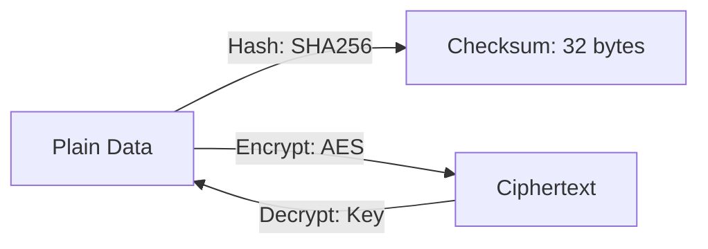

# CH-01: Cryptography (Security)

> **Source Link**: [Go Packages: crypto](https://golang.org/pkg/crypto/)

## 1. Konsep & Esensi (Definisi & Rasionalitas)

### Definisi ("Apa itu?")
Keluarga pakat `crypto/*` menyediakan algoritma kriptografi yang aman dan modern untuk enkripsi (AES), tanda tangan digital (RSA/ECDSA), dan hashing data (SHA256).

### Rasionalitas ("Why & How?")
1. **Data Integrity**: Memastikan data tidak diubah selama transit (Hashing).
2. **Confidentiality**: Menjaga kerahasiaan data sensitif (Enkripsi).
3. **Standard Compliance**: Implementasi di Go ditulis mengikuti standar keamanan internasional dan dioptimalkan dengan instruksi CPU (seperti AES-NI).

### Analogi Model Mental
Bayangkan **Mesin Penghancur & Brankas**.
- **Hashing (SHA)**: Seperti **Mesin Penghancur Kertas**. Anda masukkan dokumen, hasilnya cacahan kertas yang unik. Anda tidak bisa mengembalikan cacahan itu jadi dokumen asal, tapi anda tahu jika cacahannya berbeda, maka dokumen asalnya pasti sudah diganti.
- **Enkripsi (AES)**: Seperti **Brankas dengan Kunci**. Anda masukkan emas (Data), kunci pintunya (Key). Hanya yang punya kunci yang bisa melihat emasnya lagi.

---

## 2. Visualisasi Sistem (Mermaid & SVG)

### Mekanisme AES (SVG)

### Alur Kriptografi (Mermaid)

---

## 3. Mekanisme Pembuktian (Algoritma Detil)
Go membedah kriptografi menjadi sub-paket spesifik. Gunakan `crypto/rand` (bukan `math/rand`) untuk menghasilkan kunci atau *salt* yang aman untuk keamanan. Hashing bersifat deterministik; input yang sama akan menghasilkan hash yang selalu sama. Enkripsi simetris (AES) jauh lebih cepat daripada enkripsi asimetris (RSA) untuk data besar.

---

## 4. Lab Praktis (Examples)
Silakan tinjau folder [examples/](./examples) untuk eksperimen berikut:
- `01_password_hashing.go`: Mengamankan data dengan SHA256 (plus Salt).
- `02_aes_encryption.go`: Enkripsi dan dekripsi pesan rahasia secara simetris (AES-GCM).

---
*Unit ini memenuhi standar Platinum Gold (PPM V4).*

