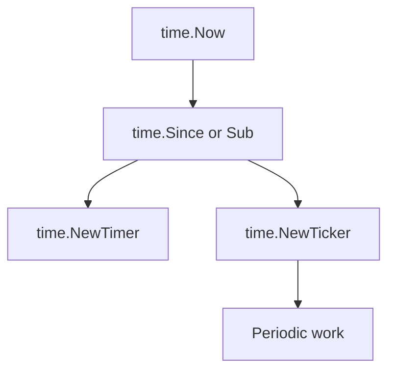

# CH-01: `time` for Duration, Timer, and Ticker

## 1. Tahap 1: Source Alignment dan Judul

- **Source Link**: [time package](https://pkg.go.dev/time)
- **Framing**: Package `time` sangat sentral di Go karena hampir semua aplikasi butuh membaca waktu, mengukur durasi, atau menjalankan sesuatu berdasarkan jeda dan interval.

## 2. Tahap 2: Konsep dan Rasionalitas

### Definisi
Paket `time` menyediakan tipe `Time` dan `Duration`, plus utility seperti `Sleep`, `Timer`, dan `Ticker` untuk penjadwalan berbasis waktu.

### Rasionalitas
Topik ini penting karena:

1. **Pengukuran waktu adalah kebutuhan dasar banyak aplikasi**  
   Mulai dari timeout sampai logging dan benchmarking.
2. **Timer dan ticker membentuk pola scheduling sederhana**  
   Banyak event loop dan worker ringan bergantung pada primitive ini.
3. **Durasi dan waktu memiliki peran berbeda**  
   `Time` mewakili titik waktu, sedangkan `Duration` mewakili jarak antar waktu.

### Analogi Model Mental
Bayangkan satu alat yang sekaligus bisa jadi jam, stopwatch, dan alarm. Itulah kira-kira peran package `time` di banyak program Go.

### Terminologi Teknis
- **Time**: titik waktu tertentu.
- **Duration**: selisih atau lama waktu.
- **Ticker**: sinyal berulang pada interval tertentu.

## 3. Tahap 3: Visualisasi Sistem

## 4. Tahap 4: Mekanisme Pembuktian

`time.Duration` direpresentasikan sebagai jumlah nanodetik, sedangkan `Time` membawa informasi titik waktu dan clock reading yang relevan untuk perhitungan durasi. `Timer` mengirim satu sinyal setelah jeda tertentu, sementara `Ticker` terus mengirim sinyal berkala sampai dihentikan. Perbedaan ini penting agar pembaca tidak mencampur event satu kali dan event berulang.

Nilai praktisnya:
- membantu pembaca menulis timeout, polling, dan interval sederhana;
- memperjelas kapan memakai `Sleep`, `Timer`, atau `Ticker`;
- memberi fondasi yang aman sebelum pembahasan timeouts di area lain seperti networking.

## 5. Tahap 5: Lab Praktis

Lihat pembuktian di folder [examples/](./examples):
- [01_timer_ticker.go](./examples/01_timer_ticker.go) - Perbandingan perilaku timer sekali jalan dan ticker berulang.

---
*Status: [x] Complete*
