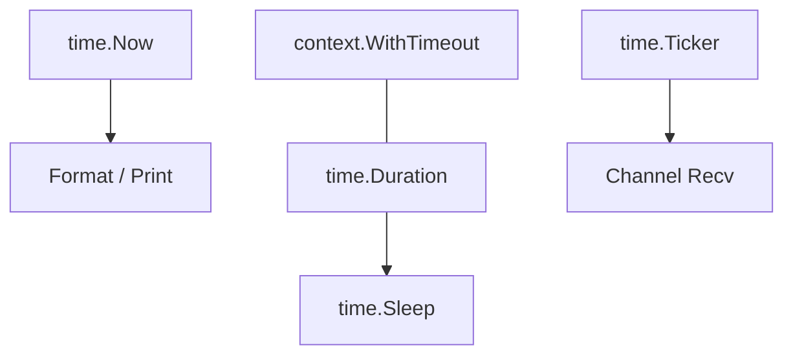

# CH-01: Time Management (Lifecycle & Precision)

> **Source Link**: [Go Packages: time](https://golang.org/pkg/time/)

## 1. Konsep & Esensi (Definisi & Rasionalitas)

### Definisi ("Apa itu?")
Pakat `time` menyediakan fungsionalitas untuk mengukur, menampilkan, dan mengelola waktu, durasi, serta penjadwalan (tickers/timers).

### Rasionalitas ("Why & How?")
1. **Precision**: Mendukung resolusi hingga nanodetik yang esensial untuk benchmarking dan sistem real-time.
2. **Monotonicity**: Menyediakan *Monotonic Time* yang aman dari perubahan jam sistem oleh NTP, menjamin perhitungan durasi tetap akurat.
3. **Async Support**: Integrasi erat dengan `select` dan `channel` untuk timeout dan interval pengerjaan.

### Analogi Model Mental
Bayangkan **Jam Tangan Serbaguna dengan Stopwatch & Alarm**.
Anda butuh tahu jam berapa sekarang (**Time**), berapa lama Anda lari (**Duration**), dan ingin dipanggil setiap 5 menit untuk minum (**Ticker/Interval**). Pakat `time` adalah jam tangan tersebut yang membantu Anda disiplin dalam mengeksekusi tugas.

---

## 2. Visualisasi Sistem (Mermaid & SVG)

### Event Loop Ticker (SVG)

### Hirarki Waktu (Mermaid)

---

## 3. Mekanisme Pembuktian (Algoritma Detil)
Go menggunakan format waktu yang unik: `Mon Jan 2 15:04:05 MST 2006` (Layout 1234567). Ingatlah bahwa `time.Duration` adalah `int64` dalam satuan nanodetik. Selalu gunakan `time.Since(start)` untuk mengukur durasi daripada pengurangan manual dua objek `Time` agar mendapatkan manfaat dari jam monotonik.

---

## 4. Lab Praktis (Examples)
Silakan tinjau folder [examples/](./examples) untuk eksperimen berikut:
- `01_timer_ticker.go`: Perbedaan Timer (sekali jalan) dan Ticker (berulang).
- `02_parsing_time.go`: Mengubah string tanggal kustom menjadi objek `Time` yang valid.

---
*Unit ini memenuhi standar Platinum Gold (PPM V4).*
