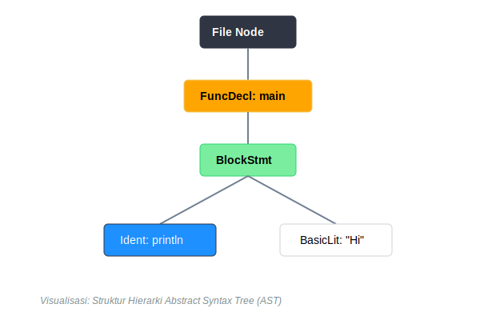
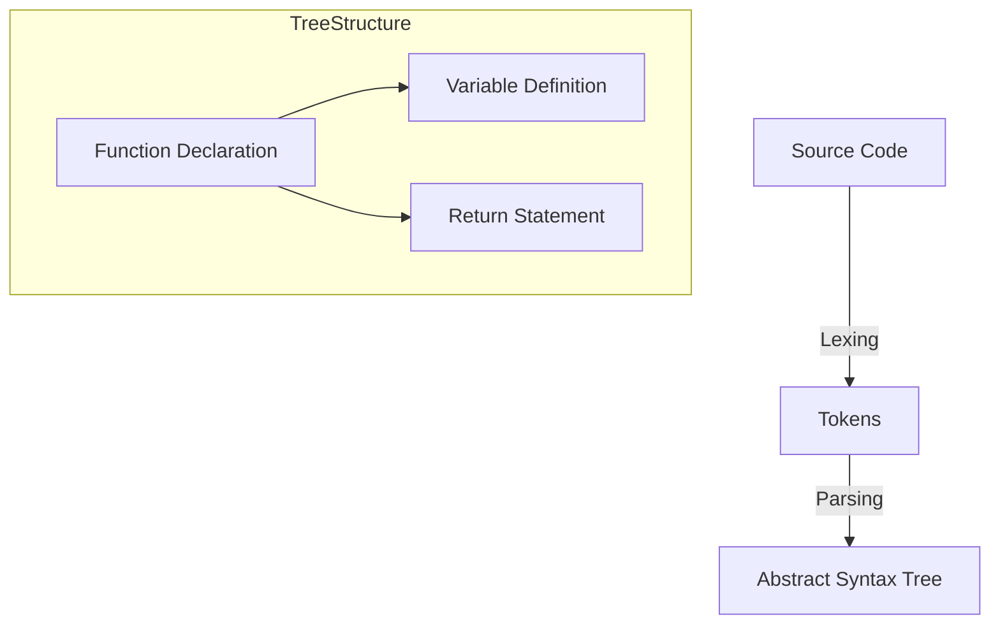

# CH-01: Parser & AST (Compiler Frontend)

> **Source Link**: [Go Compiler: Parser Source](https://github.com/golang/go/blob/master/src/cmd/compile/internal/syntax/parser.go) | [Go Blog: The Go GC (Frontend mention)](https://blog.golang.org/ismmkeynote)

## 1. Konsep & Esensi (Definisi & Rasionalitas)

### Definisi ("Apa itu?")
Parser adalah tahap awal kompilasi Go yang mengubah teks mentah kode sumber (`.go`) menjadi struktur data memori bernama **Abstract Syntax Tree (AST)** yang mewakili hierarki logika program.

### Rasionalitas ("Why & How?")
1. **Validation**: Memastikan kode mengikuti aturan sintaksis bahasa Go (misal: penutupan kurung, urutan kata kunci).
2. **Logical Mapping**: Mengonversi teks linier menjadi pohon keputusan sehingga komputer bisa memahami hubungan antar variabel, fungsi, dan blok logika.
3. **Type Checking Foundation**: AST menjadi dasar bagi tahap berikutnya untuk memeriksa apakah tipe data yang digunakan sudah konsisten.

### Analogi Model Mental
Bayangkan **Membaca Resep Masakan**.
Teks resep adalah **Source Code**. Mata dan otak Anda (**Parser**) membaca teks tersebut bukan sebagai huruf per huruf, tapi sebagai urutan langkah (**AST**): "Siapkan bahan" -> "Potong bawang" -> "Tumis". Anda sekarang punya peta mental tentang apa yang harus dilakukan sebelum benar-benar menyalakan api.

---

## 2. Visualisasi Sistem (Mermaid & SVG)

### Struktur Pohon (SVG)

### Alur Kerja (Mermaid)

---

## 3. Mekanisme Pembuktian (Algoritma Detil)
Parser Go adalah *top-down recursive descent parser*. Ia menggunakan token yang dihasilkan oleh *Scanner* (Lexer) untuk membangun node AST secara rekursif. Go sangat mengoptimalkan kecepatan tahap ini; parser Go dianggap salah satu yang tercepat untuk bahasa dengan fitur setara. Setelah AST terbentuk, Go akan melakukan *Type Checking* untuk memastikan semua referensi simbol valid.

---

## 4. Lab Praktis (Examples)
Silakan tinjau folder [examples/](./examples) untuk eksperimen berikut:
- `01_inspect_ast.go`: Menggunakan paket `go/ast` dan `go/parser` untuk melihat struktur internal kode Go Anda sendiri.
- `02_token_scanner.go`: Melihat bagaimana Go memecah teks menjadi token mentah.

---
*Unit ini memenuhi standar Platinum Gold (PPM V4).*
