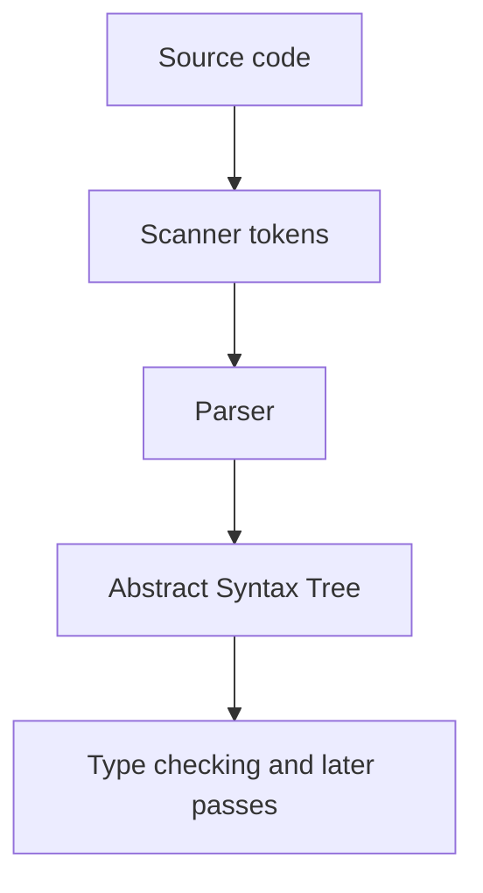

# CH-01: Parser and AST in the Compiler Frontend

## 1. Tahap 1: Source Alignment dan Judul

- **Source Link**: [go/parser package](https://pkg.go.dev/go/parser) | [go/ast package](https://pkg.go.dev/go/ast) | [compiler syntax parser source](https://github.com/golang/go/blob/master/src/cmd/compile/internal/syntax/parser.go)
- **Framing**: Parser dan AST adalah titik pertama saat compiler berhenti melihat kode sebagai teks mentah dan mulai melihatnya sebagai struktur program.

## 2. Tahap 2: Konsep dan Rasionalitas

### Definisi
Parser membaca token hasil pemindaian lexer lalu membangun **Abstract Syntax Tree (AST)**, yaitu representasi pohon yang menunjukkan bentuk deklarasi, ekspresi, dan blok logika program Go.

### Rasionalitas
Topik ini penting karena:

1. **Syntax harus dipahami sebelum hal lain bisa terjadi**  
   Type checking, optimisasi, dan code generation semuanya bergantung pada struktur awal yang benar.
2. **AST memberi bentuk hierarkis pada source code**  
   Program tidak lagi dilihat sebagai deretan karakter, tetapi sebagai node dan relasi antar node.
3. **Frontend menentukan kualitas tahap berikutnya**  
   Jika parsing gagal atau struktur tidak terbentuk dengan benar, pipeline compiler berhenti di sini.

### Analogi Model Mental
Bayangkan arsitek yang menerima tumpukan instruksi tertulis lalu mengubahnya menjadi blueprint bangunan. Blueprint itu belum menjadi gedung, tetapi tanpa blueprint yang benar, tahap konstruksi tidak bisa dimulai.

### Terminologi Teknis
- **Token**: unit sintaksis dasar hasil scanning.
- **Parser**: komponen yang menyusun token menjadi struktur yang valid.
- **AST**: representasi pohon dari bentuk sintaksis program.

## 3. Tahap 3: Visualisasi Sistem

## 4. Tahap 4: Mekanisme Pembuktian

Frontend compiler Go memecah proses awal menjadi scanning lalu parsing. Parser membangun node-node AST secara sistematis, lalu hasil ini menjadi dasar untuk validasi simbol dan tipe. Di level repositori ini, yang penting dipahami adalah hubungan sebab-akibatnya: tanpa struktur sintaksis yang valid, compiler tidak punya bahan untuk melanjutkan ke tahap tengah dan akhir.

Nilai praktisnya:
- membantu pembaca memahami mengapa error sintaks muncul sangat awal;
- menjelaskan peran `go/parser` dan `go/ast` sebagai jendela pembelajaran ke frontend compiler;
- menjadi fondasi sebelum masuk ke SSA.

## 5. Tahap 5: Lab Praktis

Lihat pembuktian di folder [examples/](./examples):
- [01_inspect_ast.go](./examples/01_inspect_ast.go) - Contoh kecil untuk mem-parse source string dan menginspeksi node penting di AST.

---
*Status: [x] Complete*
