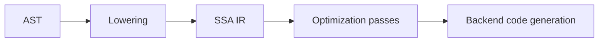

# CH-01: SSA as Compiler Middle Representation

## 1. Tahap 1: Source Alignment dan Judul

- **Source Link**: [Go compiler SSA README](https://github.com/golang/go/blob/master/src/cmd/compile/internal/ssa/README.md)
- **Framing**: SSA penting karena di sinilah compiler mulai melihat program sebagai aliran nilai yang lebih mudah dianalisis dan dioptimisasi, bukan lagi sekadar pohon sintaksis.

## 2. Tahap 2: Konsep dan Rasionalitas

### Definisi
**Static Single Assignment (SSA)** adalah representasi perantara di mana setiap nilai logis didefinisikan satu kali. Bentuk ini memudahkan compiler melacak aliran data, dependensi, dan peluang optimisasi.

### Rasionalitas
Topik ini penting karena:

1. **Optimisasi jadi lebih terstruktur**  
   Compiler lebih mudah mendeteksi constant folding, dead code, atau penyederhanaan aliran data.
2. **Bridge ke backend menjadi lebih jelas**  
   SSA berada di tengah antara AST tingkat tinggi dan instruksi mesin tingkat rendah.
3. **Model mental compiler jadi lebih akurat**  
   Pembaca mulai melihat bahwa compiler bekerja lewat beberapa representasi internal, bukan satu bentuk tunggal.

### Analogi Model Mental
Bayangkan pabrik yang memberi label unik pada setiap barang di setiap tahap produksi. Dengan label yang tidak pernah dipakai ulang, supervisor bisa melacak perubahan barang tanpa bingung mana versi lama dan mana versi baru.

### Terminologi Teknis
- **Intermediate Representation**: bentuk internal di antara source code dan machine code.
- **Value Flow**: aliran nilai antar operasi dalam program.
- **Optimization Pass**: langkah transformasi yang mencoba memperbaiki atau menyederhanakan representasi internal.

## 3. Tahap 3: Visualisasi Sistem

## 4. Tahap 4: Mekanisme Pembuktian

Setelah frontend selesai, compiler menurunkan bentuk program ke representasi yang lebih cocok untuk analisis aliran nilai. Di sinilah banyak optimisasi lebih mudah diterapkan. Untuk tujuan repositori ini, pembaca tidak perlu menghafal semua pass, tetapi perlu memahami bahwa SSA adalah tempat compiler bekerja lebih mekanis terhadap nilai, kontrol alur, dan simplifikasi program.

Nilai praktisnya:
- membantu menjelaskan kenapa beberapa optimisasi terasa "ajaib" dari sudut pandang user;
- memberi penghubung yang jelas antara tahap parsing dan tahap code generation;
- menjaga pembahasan compiler tetap runtut.

## 5. Tahap 5: Lab Praktis

Lihat pembuktian di folder [examples/](./examples):
- [01_ssa_candidate.go](./examples/01_ssa_candidate.go) - Fungsi kecil yang bisa dipakai bersama `GOSSAFUNC` untuk melihat bagaimana compiler membangun output SSA.

Catatan:
- Chapter ini sengaja memakai satu contoh lokal yang sederhana.
- Visualisasi SSA yang lebih detail tetap bergantung pada toolchain compiler saat dijalankan di environment yang mendukung.

---
*Status: [x] Complete*
