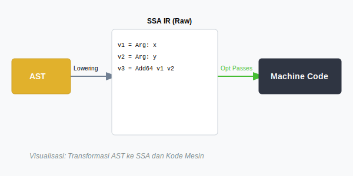
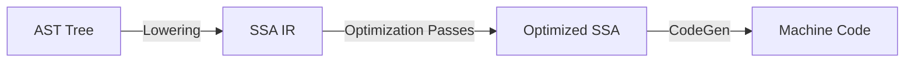

# CH-01: SSA (Static Single Assignment)

> **Source Link**: [Go Compiler: SSA Introduction](https://github.com/golang/go/blob/master/src/cmd/compile/internal/ssa/README.md)

## 1. Konsep & Esensi (Definisi & Rasionalitas)

### Definisi ("Apa itu?")
SSA adalah representasi perantara (*Intermediate Representation*) tingkat rendah dalam kompilator Go di mana setiap variabel hanya diberikan nilai tepat **satu kali**.

### Rasionalitas ("Why & How?")
1. **Optimization Clarity**: Dengan SSA, kompilator bisa dengan mudah mendeteksi kode yang tidak pernah dieksekusi (*Dead Code*) atau nilai yang konstan.
2. **Register Allocation**: Membantu memetakan variabel ke register CPU secara efisien agar eksekusi biner sangat cepat.
3. **Platform Agnostic**: Menjadi jembatan antara logika AST (tinggi) dan instruksi mesin spesifik (rendah) seperti x86 atau ARM.

### Analogi Model Mental
Bayangkan **Alur Logistik Pabrik**.
Alih-alih menyebutnya "Barang", pabrik memberi label unik pada setiap tahap: "Bahan Mentah_v1", "Setelah Dipotong_v2", "Setelah Dicat_v3". Karena setiap label hanya muncul sekali, manajer pabrik (**Kompilator SSA**) bisa tahu persis jika ada tahap yang tidak perlu (misal: dicat dua kali) dan langsung menghapusnya untuk menghemat waktu.

---

## 2. Visualisasi Sistem (Mermaid & SVG)

### Transformasi SSA (SVG)

### Alur Kompilasi (Mermaid)

---

## 3. Mekanisme Pembuktian (Algoritma Detil)
Selama fase SSA, kompilator Go menjalankan ratusan "Pass" atau langkah optimasi. Contohnya adalah *Constant Folding* (mengganti `a := 2+2` menjadi `a := 4` di waktu kompilasi) dan *Nil Check Elimination*. Anda bisa melihat output SSA dari kompilator dengan mengatur variabel lingkungan `GOSSAFUNC=main`.

---

## 4. Lab Praktis (Examples)
Silakan tinjau folder [examples/](./examples) untuk eksperimen berikut:
- `01_view_ssa_output.sh`: Skrip untuk menghasilkan visualisasi SSA HTML dari fungsi Go sederhana.
- `02_optimisation_demo.go`: Kode yang dirancang untuk membuktikan bagaimana kompilator menghapus blok kode yang tidak berguna.

---
*Unit ini memenuhi standar Platinum Gold (PPM V4).*
