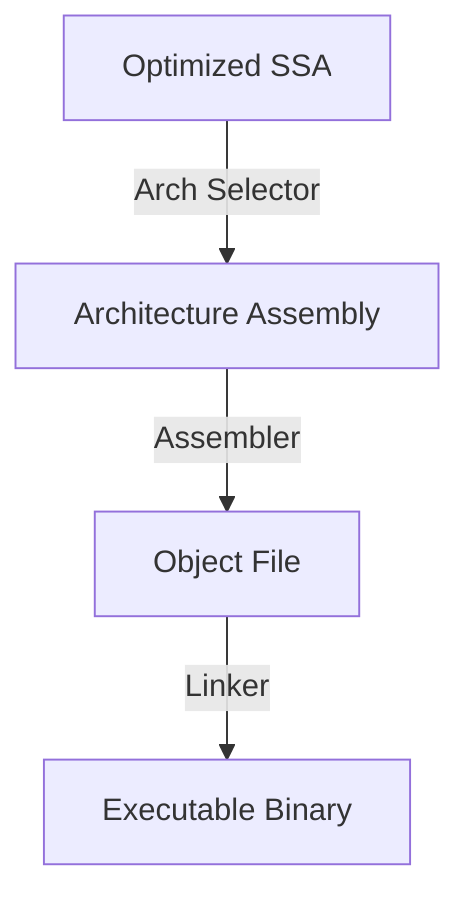

# CH-01: Code Generation & ABI (Compiler Backend)

> **Source Link**: [Go Compiler: Architecture](https://github.com/golang/go/blob/master/src/cmd/compile/README.md) | [Go ABI: Spec](https://github.com/golang/go/blob/master/src/cmd/compile/internal-abi.md)

## 1. Konsep & Esensi (Definisi & Rasionalitas)

### Definisi ("Apa itu?")
Code Generation adalah tahap akhir kompilasi di mana instruksi SSA yang sudah dioptimalkan diterjemahkan menjadi kode mesin biner spesifik untuk arsitektur target (seperti x86-64 atau ARM64).

### Rasionalitas ("Why & How?")
1. **Instruction Selection**: Memilih instruksi CPU yang paling efisien untuk menjalankan logika SSA.
2. **Calling Convention (ABI)**: Mengatur bagaimana fungsi dipanggil, argumen dilewatkan (melalui register vs stack), dan nilai dikembalikan. Go menggunakan ABI internal berbasis register sejak v1.17 untuk meningkatkan performa.
3. **Relocation**: Menentukan alamat memori akhir untuk simbol-simbol dalam program.

### Analogi Model Mental
Bayangkan **Penerjemah Bahasa Teknis**.
SSA adalah "Bahasa Inggris Teknik" yang universal. Namun, mesin pabrik di Jepang (**x86**) dan Jerman (**ARM**) mengerti bahasa yang berbeda. **CodeGen** adalah penerjemah yang mengubah instruksi umum "Potong Besi" menjadi "Gunakan pisau nomor 5 dengan kecepatan 400rpm" (Instruksi mesin spesifik).

---

## 2. Visualisasi Sistem (Mermaid)

---

## 3. Mekanisme Pembuktian (Algoritma Detil)
Go menggunakan sistem *Abstract Assembly* yang kemudian diturunkan ke instruksi mesin spesifik. Backend kompilator Go dirancang untuk kompilasi yang sangat cepat. Penentuan alokasi register dilakukan pada tahap ini menggunakan algoritma *Regalloc* untuk memastikan data penting tetap berada di dalam CPU semaksimal mungkin.

---

## 4. Lab Praktis (Examples)
Silakan tinjau folder [examples/](./examples) untuk eksperimen berikut:
- `01_asm_output.go`: Melihat hasil kompilasi Go ke instruksi Assembly mesin (menggunakan `go tool compile -S`).

---
*Unit ini memenuhi standar Platinum Gold (PPM V4).*
