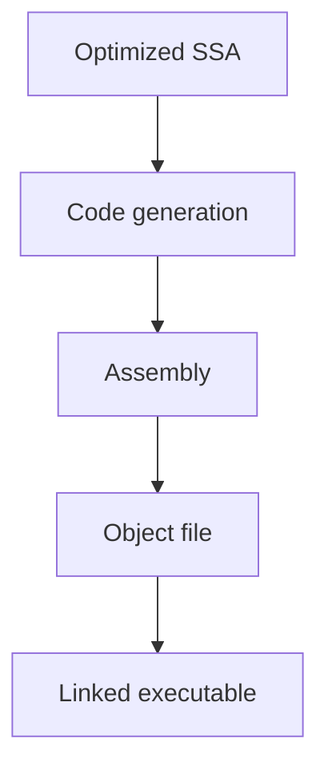

# CH-01: Code Generation and ABI Basics

## 1. Tahap 1: Source Alignment dan Judul

- **Source Link**: [compiler README](https://github.com/golang/go/blob/master/src/cmd/compile/README.md) | [internal ABI notes](https://github.com/golang/go/blob/master/src/cmd/compile/internal/abi/README.md)
- **Framing**: Setelah optimisasi selesai, compiler masih punya satu tugas besar: menurunkan representasi internal ke bentuk yang bisa dipahami mesin dan toolchain akhir.

## 2. Tahap 2: Konsep dan Rasionalitas

### Definisi
Code generation adalah tahap saat representasi compiler yang sudah siap diterjemahkan menjadi assembly atau bentuk rendah lain yang kemudian dirakit dan dilink menjadi binary. Di tahap ini, aturan ABI juga penting karena menentukan bagaimana fungsi saling memanggil.

### Rasionalitas
Topik ini penting karena:

1. **Compiler akhirnya harus berbicara dalam bahasa mesin**  
   Program Go tidak berhenti di representasi internal.
2. **ABI menentukan kontrak pemanggilan fungsi**  
   Argumen, nilai balik, dan register atau stack usage harus konsisten.
3. **Backend menjembatani abstraksi dan eksekusi nyata**  
   Di sinilah hasil kerja frontend dan middle-end benar-benar dipersiapkan untuk dijalankan.

### Analogi Model Mental
Kalau frontend menulis blueprint dan middle-end mengoptimalkan alur produksi, backend adalah tahap saat instruksi akhir diberikan ke mesin pabrik dalam format yang benar-benar bisa dieksekusi.

### Terminologi Teknis
- **Code Generation**: proses menurunkan IR ke instruksi rendah.
- **ABI**: aturan pemanggilan fungsi dan layout interaksi antar komponen biner.
- **Assembly Output**: bentuk rendah yang bisa diamati sebelum linking akhir.

## 3. Tahap 3: Visualisasi Sistem

## 4. Tahap 4: Mekanisme Pembuktian

Backend memilih bentuk instruksi yang sesuai untuk arsitektur target lalu menyiapkan data agar cocok dengan aturan ABI yang dipakai toolchain. Untuk pembaca repositori ini, yang penting bukan menghafal semua detail register, tetapi memahami bahwa tahap akhir compiler sangat dipengaruhi oleh target architecture dan kontrak pemanggilan fungsi.

Nilai praktisnya:
- membantu pembaca melihat hubungan antara output compiler dan binary final;
- menjelaskan kenapa assembly output bisa dipakai sebagai jendela belajar backend;
- memberi fondasi sebelum masuk ke runtime behavior yang memakai hasil binary itu.

## 5. Tahap 5: Lab Praktis

Lihat pembuktian di folder [examples/](./examples):
- [01_asm_output.go](./examples/01_asm_output.go) - Fungsi kecil yang bisa dipakai bersama `go tool compile -S` untuk melihat keluaran assembly dasar.

---
*Status: [x] Complete*
