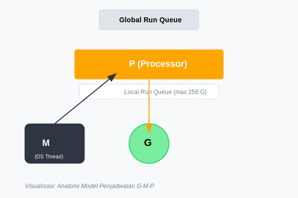
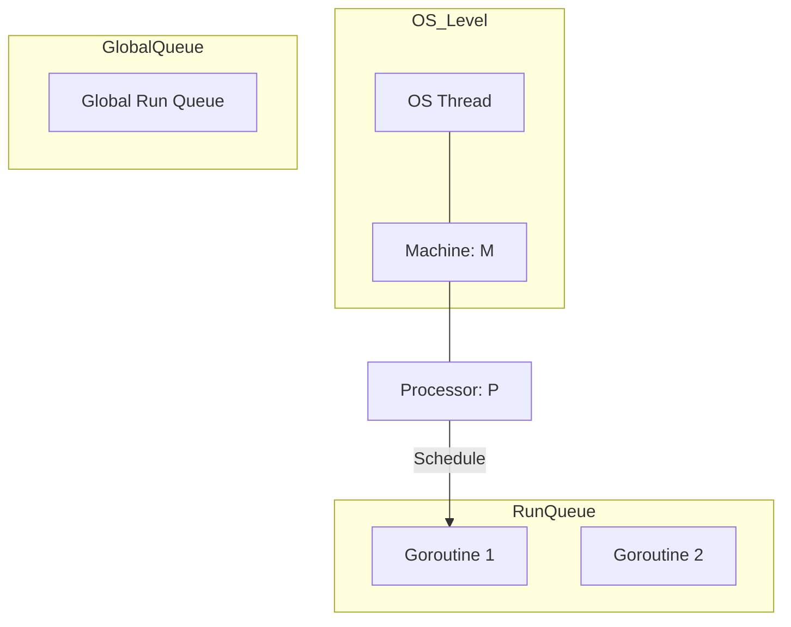

# CH-01: G-M-P Model (Scheduler Architecture)

> **Source Link**: [Go Runtime: Hacking.md](https://github.com/golang/go/blob/master/src/runtime/Hacking.md) | [Go Blog: Analysis of the Go Scheduler](https://blog.gopheracademy.com/advent-2015/go-scheduler/)

## 1. Konsep & Esensi (Definisi & Rasionalitas)

### Definisi ("Apa itu?")
Model G-M-P adalah arsitektur penjadwalan Go yang memisahkan abstraksi eksekusi (**G**oroutine), pembungkus thread OS (**M**achine), dan sumber daya eksekusi (**P**rocessor) untuk mengelola ribuan tugas di atas sedikit inti CPU.

### Rasionalitas ("Why & How?")
1. **M:N Scheduling**: Menghindari overhead pembuatan thread OS yang mahal (2MB stack vs 2KB stack Goroutine).
2. **Resource Decoupling**: **P** bertindak sebagai perantara yang menampung antrean lokal Goroutine, memungkinkan worker (**M**) untuk diganti atau ditidurkan tanpa kehilangan tugas.
3. **Efficiency**: Mengurangi *context switching* di level kernel dengan melakukan penjadwalan di user-space.

### Analogi Model Mental
Bayangkan **Sebuah Kafe (Runtime)**.
- **G (Goroutine)**: Pelanggan yang membawa pesanan.
- **P (Processor)**: Meja kasir (Resource). Hanya ada sejumlah meja kasir sebanyak Inti CPU Anda.
- **M (Machine)**: Staf Kasir (Worker Thread). Staf bisa datang dan pergi, tapi mereka hanya bisa melayani pelanggan jika mereka memiliki akses ke Meja Kasir (**P**).

---

## 2. Visualisasi Sistem (Mermaid & SVG)

### Anatomi G-M-P (SVG)

### Struktur Penjadwal (Mermaid)

---

## 3. Mekanisme Pembuktian (Algoritma Detil)
Scheduler Go bekerja secara kooperatif dan preemptive. Saat Goroutine melakukan syscall atau blocking, **M** akan dilepaskan dari **P**, dan **P** akan mencari **M** baru untuk melanjutkan pengerjaan Goroutine lain. Algoritma **Work Stealing** memungkinkan sebuah **P** yang menganggur untuk mencuri 50% Goroutine dari antrean **P** lain yang sedang sibuk.

---

## 4. Lab Praktis (Examples)
Silakan tinjau folder [examples/](./examples) untuk eksperimen berikut:
- `01_gmp_inspection.go`: Menggunakan `runtime.NumGoroutine()` dan `GOMAXPROCS` untuk melihat interaksi scheduler.
- `02_trace_scheduler.go`: Visualisasi pengerjaan scheduler menggunakan `go tool trace`.

---
*Unit ini memenuhi standar Platinum Gold (PPM V4).*
