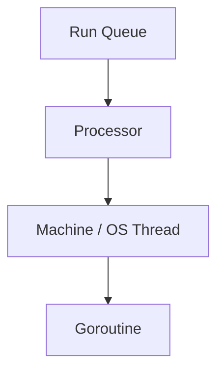

# CH-01: G-M-P Model

> **Source Link**: [runtime/HACKING.md](https://github.com/golang/go/blob/master/src/runtime/HACKING.md) | [runtime/proc.go](https://go.dev/src/runtime/proc.go)

## Tahap 1: Konsep dan Intuisi

### Apa itu?
Model G-M-P adalah cara runtime Go memisahkan tiga peran utama saat menjalankan goroutine:
- **G**: unit kerja, yaitu goroutine;
- **M**: thread OS yang benar-benar mengeksekusi kode;
- **P**: resource scheduler yang memegang antrean kerja dan konteks eksekusi.

### Kenapa desain ini dipakai?
Go ingin menjalankan banyak goroutine tanpa harus membuat satu thread OS untuk setiap tugas. Dengan memisahkan `G`, `M`, dan `P`, runtime bisa menjadwalkan pekerjaan dengan lebih hemat dibanding model satu-thread-satu-task.

### Analogi singkat
Bayangkan dapur restoran:
- `G` adalah pesanan;
- `M` adalah koki;
- `P` adalah meja kerja yang punya alat dan antrean lokal.

Koki hanya bisa kerja efektif kalau ia sedang memegang meja kerja. Saat satu koki terblokir, meja kerja bisa dipasangkan ke koki lain.

## Tahap 2: Visualisasi Sistem

### Anatomi G-M-P

### Alur scheduler sederhana

## Tahap 3: Mekanisme Internal

Secara umum, scheduler Go bekerja seperti ini:
- goroutine yang siap jalan masuk ke antrean lokal `P` atau antrean global;
- `M` mengambil kerja lewat `P` yang sedang dipegangnya;
- jika satu `P` kehabisan kerja, runtime bisa melakukan **work stealing** dari `P` lain;
- jika sebuah goroutine masuk ke syscall yang memblokir, runtime bisa melepas `P` dari `M` itu agar pekerjaan lain tetap jalan.

Detail implementasinya lebih kaya dari model sederhana ini, tetapi inti desainnya tetap: pisahkan unit kerja, worker, dan resource scheduler agar orkestrasi tetap efisien.

## Tahap 4: Lab Praktis

Lihat folder [examples/](./examples) untuk percobaan berikut:
- `01_gmp_inspection.go`: mengamati `GOMAXPROCS` dan jumlah goroutine sebelum, saat, dan sesudah beban paralel singkat.

## Tahap 5: Ringkasan Praktis

- G-M-P adalah model inti scheduler Go.
- `P` penting karena ia membawa antrean kerja lokal dan konteks scheduler.
- Tujuan utamanya adalah membuat banyak goroutine tetap murah dijalankan tanpa terlalu bergantung pada thread OS.

---
*Status: [x] Complete*
