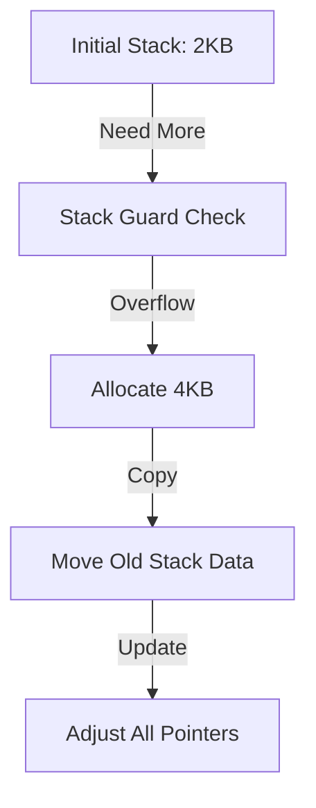

# CH-01: Stack Growth & Copying (Dynamic Execution)

> **Source Link**: [Go Runtime: Stack Management](https://github.com/golang/go/blob/master/src/runtime/stack.go) | [Go Blog: Contiguous Stacks](https://blog.golang.org/contiguity)

## 1. Konsep & Esensi (Definisi & Rasionalitas)

### Definisi ("Apa itu?")
Stack Management Go adalah mekanisme di mana setiap Goroutine dimulai dengan stack yang sangat kecil (2KB) dan secara dinamis akan tumbuh (*Growth*) atau dipindahkan (*Copying*) ke blok memori baru saat fungsinya membutuhkan ruang lebih besar.

### Rasionalitas ("Why & How?")
1. **Concurrency Scalability**: Memungkinkan jutaan Goroutine aktif tanpa menghabiskan bandwidth memori (Thread OS biasa butuh 2MB per thread).
2. **Deep Recursion Safe**: Tidak seperti bahasa lain yang akan terkena *Stack Overflow*, Go akan terus melipatgandakan ukuran stack hingga batas memory sistem.
3. **Contiguous Layout**: Menjamin performa akses cache CPU yang optimal karena data stack tetap berada dalam blok memori tunggal yang berurutan.

### Analogi Model Mental
Bayangkan **Tas Lipat Kolapsibel**.
Awalnya tas Anda kecil (2KB) karena hanya membawa dompet. Saat Anda membeli banyak oleh-oleh (Fungsi rekursif), tas tersebut otomatis **Memuai** menjadi koper. Jika sudah penuh, tas tersebut tidak robek, melainkan isinya dipindahkan dengan cepat ke **Brankas Besar (Blok Memori Baru)** yang sudah disiapkan oleh petugas hotel (Runtime).

---

## 2. Visualisasi Sistem (Mermaid & SVG)

### Mekanisme Copying (SVG)

### Alur Resizing (Mermaid)

---

## 3. Mekanisme Pembuktian (Algoritma Detil)
Setiap pemanggilan fungsi di Go diawali dengan *Stack Guard Check*. Jika sisa stack tidak cukup, runtime memanggil `runtime.newstack`. Karena data stack dipindahkan, Go harus menyesuaikan semua pointer yang menunjuk ke data di stack lama agar menunjuk ke alamat baru. Inilah alasan mengapa Go tidak mengizinkan pointer tetap menunjuk ke stack yang sudah didealokasikan (berbeda dengan C).

---

## 4. Lab Praktis (Examples)
Silakan tinjau folder [examples/](./examples) untuk eksperimen berikut:
- `01_stack_recursion.go`: Mengamati pertumbuhan stack melalui fungsi rekursif dalam dan tracing runtime.
- `02_pointer_escape_stack.go`: Membuktikan bagaimana pointer tetap valid setelah stack dipindahkan.

---
*Unit ini memenuhi standar Platinum Gold (PPM V4).*
