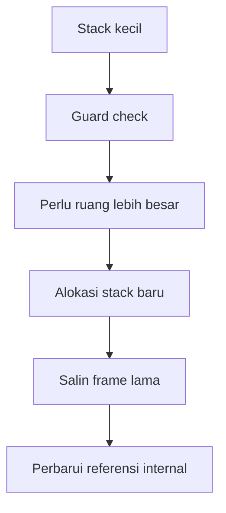

# CH-01: Stack Growth and Copying

> **Source Link**: [runtime/stack.go](https://go.dev/src/runtime/stack.go) | [Go Blog: Contiguous stacks](https://go.dev/blog/contiguous-stacks)

## Tahap 1: Konsep dan Intuisi

### Apa itu?
Setiap goroutine di Go dimulai dengan stack kecil. Saat kebutuhan frame fungsi bertambah, runtime dapat menumbuhkan stack itu dan memindahkan isinya ke blok memori yang lebih besar.

### Kenapa desain ini dipakai?
Kalau setiap goroutine langsung diberi stack besar seperti thread OS tradisional, memori akan cepat habis. Go memilih pendekatan stack kecil yang bisa tumbuh supaya concurrency tetap murah.

### Analogi singkat
Bayangkan koper lipat:
- awalnya kecil supaya ringan dibawa;
- saat isi bertambah, koper dipindahkan ke ukuran yang lebih besar;
- barangnya tetap sama, hanya wadahnya yang berubah.

## Tahap 2: Visualisasi Sistem

### Mekanisme copying

### Alur pertumbuhan stack

## Tahap 3: Mekanisme Internal

Saat fungsi dipanggil, runtime memastikan sisa stack masih cukup. Jika tidak cukup, runtime masuk ke jalur pertumbuhan stack.

Intinya:
- stack goroutine disimpan kontigu;
- saat penuh, runtime mengalokasikan area yang lebih besar;
- data frame lama disalin ke area baru;
- pointer internal yang relevan perlu tetap konsisten setelah pemindahan.

Model ini membuat goroutine murah dibuat, tetapi juga berarti kita perlu memahami bahwa stack goroutine bukan blok statis yang ukurannya tetap dari awal sampai akhir.

## Tahap 4: Lab Praktis

Lihat folder [examples/](./examples) untuk percobaan berikut:
- `01_stack_recursion.go`: menjalankan rekursi dalam untuk menunjukkan bahwa runtime dapat menumbuhkan stack goroutine secara dinamis.

## Tahap 5: Ringkasan Praktis

- Stack goroutine di Go kecil di awal, lalu tumbuh saat dibutuhkan.
- Pertumbuhan stack membantu Go menjaga biaya concurrency tetap rendah.
- Pemahaman ini penting saat membahas runtime, recursion dalam, dan perilaku fungsi yang intensif stack.

---
*Status: [x] Complete*
