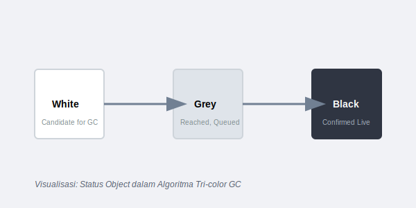
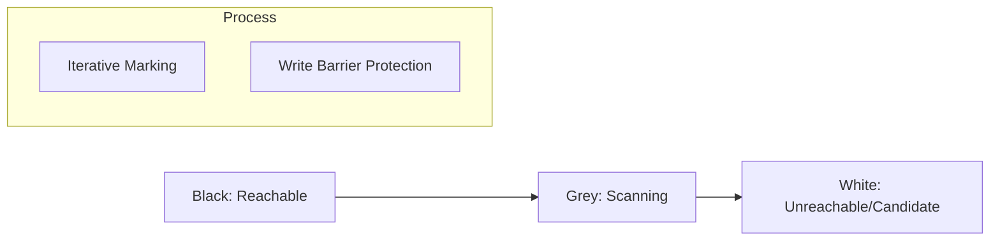

# CH-01: Tri-color Algorithm (Garbage Collection)

> **Source Link**: [Go Runtime: GC Design](https://github.com/golang/go/blob/master/src/runtime/mgc.go) | [Go Blog: Getting to Go (GC History)](https://blog.golang.org/ismmkeynote)

## 1. Konsep & Esensi (Definisi & Rasionalitas)

### Definisi ("Apa itu?")
Algoritma Tri-color adalah mekanisme *Incremental Mark-and-Sweep* yang digunakan Go untuk mengidentifikasi objek yang masih digunakan (live) dan objek yang bisa dihapus dari memori tanpa menghentikan program dalam waktu lama (*Low Latency*).

### Rasionalitas ("Why & How?")
1. **Latency over Throughput**: Go mendesain GC untuk meminimalkan waktu jeda (*Stop-The-World*) agar aplikasi tetap responsif.
2. **Concurrent Marking**: GC berjalan bersamaan dengan kode aplikasi (mutator), sehingga membutuhkan mekanisme status (Warna) untuk mendeteksi perubahan referensi data saat proses scanning.

### Analogi Model Mental
Bayangkan **Membersihkan Gudang (Memori)** saat orang masih bekerja di dalamnya.
- **Putih**: Barang yang belum diperiksa (Default: Calon sampah).
- **Abu-abu**: Barang yang sudah ditandai "Penting" tapi isinya (referensinya) belum diperiksa.
- **Hitam**: Barang yang sudah dipastikan "Penting" dan semua isinya juga sudah diperiksa.
Tujuan akhir: Hapus semua barang yang tetap berwarna Putih.

---

## 2. Visualisasi Sistem (Mermaid & SVG)

### Status Object (SVG)

### Alur Kerja (Mermaid)

---

## 3. Mekanisme Pembuktian (Algoritma Detil)
Go menggunakan **Write Barrier** saat GC berjalan. Jika aplikasi mencoba mengubah referensi pointer objek Hitam ke objek Putih, Write Barrier akan mengubah objek Putih tersebut menjadi Abu-abu agar tidak terhapus secara tidak sengaja. Proses ini memastikan integritas data dalam lingkungan multi-threaded yang berjalan paralel dengan kolektor sampah.

---

## 4. Lab Praktis (Examples)
Silakan tinjau folder [examples/](./examples) untuk eksperimen berikut:
- `01_gc_trace.go`: Memantau perilaku GC menggunakan variabel lingkungan `GODEBUG=gctrace=1`.
- `02_mem_allocation.go`: Simulasi alokasi masif untuk memicu GC Pacing.

---
*Unit ini memenuhi standar Platinum Gold (PPM V4).*
