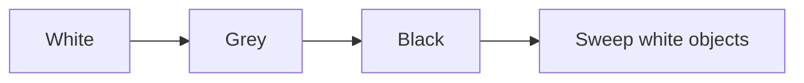

# CH-01: Tri-color Algorithm

> **Source Link**: [Go GC guide](https://go.dev/doc/gc-guide) | [runtime/mgc.go](https://go.dev/src/runtime/mgc.go)

## Tahap 1: Konsep dan Intuisi

### Apa itu?
Tri-color adalah model mental yang dipakai untuk menjelaskan bagaimana garbage collector membedakan objek yang masih perlu dipertahankan dari objek yang bisa dibersihkan.

### Kenapa desain ini dipakai?
Go ingin menjaga jeda GC tetap rendah. Karena itu, banyak pekerjaan marking dilakukan sambil program tetap berjalan. Model tri-color membantu runtime menjaga konsistensi saat collector dan program aktif bersamaan.

### Analogi singkat
Bayangkan sedang memilah barang di gudang:
- **putih**: belum dipastikan masih dibutuhkan;
- **abu-abu**: sudah ditemukan penting, tapi isi atau referensinya belum ditelusuri penuh;
- **hitam**: sudah aman, dan relasinya sudah diperiksa.

## Tahap 2: Visualisasi Sistem

### Status objek

### Alur kerja umum

## Tahap 3: Mekanisme Internal

Secara sederhana, prosesnya berjalan seperti ini:
- runtime mulai dari root yang diketahui masih hidup;
- objek yang ditemukan masuk ke status abu-abu;
- collector menelusuri referensi dari objek abu-abu lalu menghitamkannya;
- objek yang tetap putih sampai akhir fase marking menjadi kandidat untuk dibersihkan.

Saat marking berjalan bersamaan dengan program, runtime memakai **write barrier** agar perubahan referensi baru tidak membuat objek hidup terlewat dari proses penandaan.

Model ini menyederhanakan banyak detail implementasi nyata, tetapi cukup tepat untuk memahami arah kerja GC Go.

## Tahap 4: Lab Praktis

Lihat folder [examples/](./examples) untuk percobaan berikut:
- `01_gc_trace.go`: memicu GC dan membaca statistik memori, lalu bisa dijalankan bersama `GODEBUG=gctrace=1` untuk melihat trace collector.

## Tahap 5: Ringkasan Praktis

- Tri-color membantu menjelaskan fase marking dalam GC Go.
- Tujuan utamanya bukan throughput maksimum, tetapi jeda yang lebih terkendali untuk aplikasi umum.
- Write barrier penting agar marking tetap aman saat program masih terus memodifikasi heap.

---
*Status: [x] Complete*
