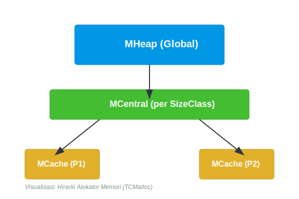
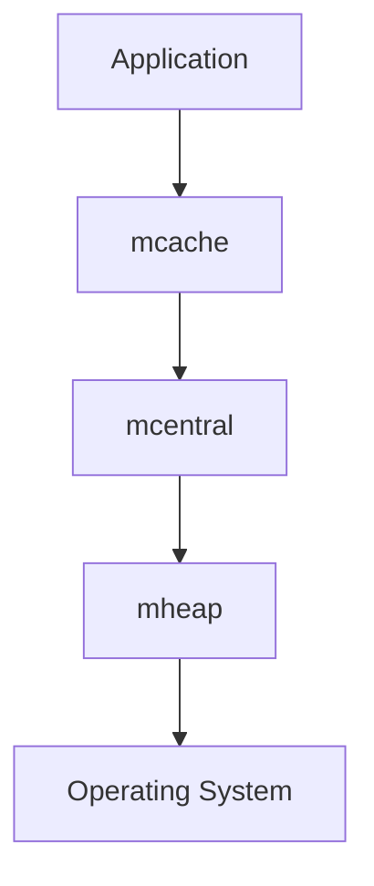

# CH-01: Spans and Arenas

> **Source Link**: [runtime/malloc.go](https://go.dev/src/runtime/malloc.go) | [Go GC guide](https://go.dev/doc/gc-guide)

## Tahap 1: Konsep dan Intuisi

### Apa itu?
Allocator Go adalah bagian runtime yang bertugas menyediakan memori untuk objek baru. Di balik layar, runtime memakai struktur seperti span, cache lokal, dan heap global supaya alokasi umum bisa tetap cepat.

### Kenapa desain ini dipakai?
Mayoritas program sering membuat objek kecil dalam jumlah besar. Kalau setiap alokasi harus lewat jalur global yang mahal, performa akan cepat turun. Karena itu runtime memecah tanggung jawab allocator ke beberapa lapisan agar contention dan fragmentasi lebih terkendali.

### Analogi singkat
Bayangkan gudang bertingkat:
- **arena** adalah area gudang besar;
- **span** adalah blok rak dengan ukuran slot tertentu;
- objek program adalah barang yang ditempatkan ke slot yang ukurannya paling sesuai.

Dengan model ini, barang kecil tidak perlu selalu minta area gudang baru dari nol.

## Tahap 2: Visualisasi Sistem

### Hirarki allocator

### Alur umum alokasi

## Tahap 3: Mekanisme Internal

Secara umum, runtime memisahkan jalur alokasi berdasarkan ukuran:
- objek sangat kecil bisa memakai jalur optimisasi khusus;
- objek kecil biasanya dilayani lewat cache lokal agar tidak selalu berebut lock global;
- objek lebih besar akan turun ke heap global.

Struktur seperti `mcache`, `mcentral`, `mheap`, dan `mspan` membantu runtime mengelompokkan slot memori berdasarkan kelas ukuran. Ini bukan berarti semua alokasi selalu murah, tetapi desain ini membuat kasus umum jauh lebih efisien.

## Tahap 4: Lab Praktis

Lihat folder [examples/](./examples) untuk percobaan berikut:
- `01_alloc_profiling.go`: membuat banyak alokasi kecil dan membaca `runtime.MemStats` untuk melihat perubahan statistik memori.

## Tahap 5: Ringkasan Praktis

- Allocator Go dirancang untuk membuat alokasi umum tetap cepat dan cukup skalabel.
- Struktur seperti span dan heap penting untuk memahami organisasi memori runtime.
- Pemahaman allocator membantu saat membaca perilaku `MemStats`, GC, dan biaya alokasi objek.

---
*Status: [x] Complete*
