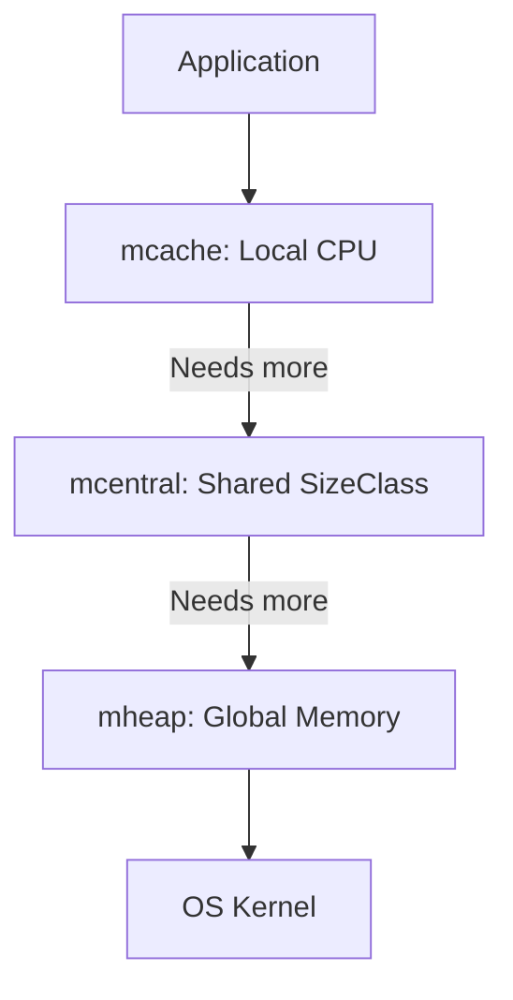

# CH-01: Spans & Arenas (Memory Allocator)

> **Source Link**: [Go Runtime: Memory Management](https://github.com/golang/go/blob/master/src/runtime/malloc.go) | [Go Blog: Memory Management](https://blog.golang.org/allocation-pacing)

## 1. Konsep & Esensi (Definisi & Rasionalitas)

### Definisi ("Apa itu?")
Allocator Go adalah sistem manajemen memori berbasis **TCMalloc** yang membagi memori menjadi hirarki blok bernama `mspan` (rentang memori) dan `mcache` untuk meminimalkan fragmentasi dan persaingan lock antar CPU.

### Rasionalitas ("Why & How?")
1. **Concurrency Performance**: Dengan memberikan setiap processor (**P**) cache lokal (`mcache`), alokasi objek kecil tidak memerlukan lock global yang lambat.
2. **Fragmentation Control**: Memori dibagi menjadi kelas-kelas ukuran (*Size Classes*) sehingga objek kecil selalu menempati slot yang pas ukurannya.
3. **Huge Pages**: Menggunakan unit besar bernama `Arena` (64MB) untuk meminta memori dari OS secara efisien.

### Analogi Model Mental
Bayangkan **Manajemen Hotel Besar**.
- **Arena**: Lantai hotel (Blok besar).
- **MSpan**: Kamar hotel (Kelompok blok dengan ukuran sama).
- **Object**: Tamu (Data Anda).
Jika tamu datang rombongan (alokasi banyak), hotel memberikan satu lantai khusus (**Span**) agar mereka tidak bercampur dengan tamu lain dan proses administrasi (**Locking**) jadi lebih cepat karena sudah dikelola per lantai.

---

## 2. Visualisasi Sistem (Mermaid & SVG)

### Hirarki Alokator (SVG)

### Struktur Memori (Mermaid)

---

## 3. Mekanisme Pembuktian (Algoritma Detil)
Alokasi dibagi menjadi tiga jalur:
- **Tiny (< 16B)**: Digabung ke dalam satu slot memori.
- **Small (16B - 32KB)**: Dialokasikan dari `mcache` lokal.
- **Large (> 32KB)**: Dialokasikan langsung dari `mheap` global.
Sistem ini menjamin bahwa alokasi mayoritas aplikasi (objek kecil) hampir instan karena tidak ada persaingan antar thread.

---

## 4. Lab Praktis (Examples)
Silakan tinjau folder [examples/](./examples) untuk eksperimen berikut:
- `01_alloc_profiling.go`: Menggunakan `runtime/pprof` untuk melihat di mana memori dialokasikan.
- `02_stats_inspection.go`: Membaca `runtime.MemStats` untuk melihat jumlah span dan objek aktif.

---
*Unit ini memenuhi standar Platinum Gold (PPM V4).*
