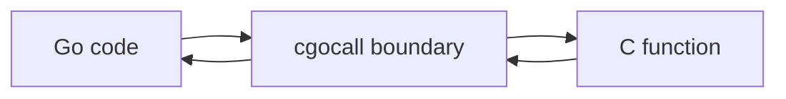

# CH-01: Cgo Barrier

> **Source Link**: [cmd/cgo](https://pkg.go.dev/cmd/cgo) | [runtime/cgocall.go](https://go.dev/src/runtime/cgocall.go)

## Tahap 1: Konsep dan Intuisi

### Apa itu?
Cgo adalah jembatan yang memungkinkan kode Go memanggil fungsi C atau berinteraksi dengan library C. Begitu kode menyeberang ke sisi C, runtime Go harus mengelola transisi itu dengan hati-hati.

### Kenapa desain ini penting?
Go punya scheduler, goroutine, stack yang bisa tumbuh, dan garbage collector. Dunia C tidak otomatis mengikuti aturan itu. Karena itu, pemanggilan cgo membawa overhead dan aturan tambahan yang tidak muncul pada kode Go murni.

### Analogi singkat
Bayangkan gerbang perbatasan:
- di sisi Go, lalu lintasnya diatur runtime;
- di sisi C, aturannya berbeda;
- saat menyeberang, ada pemeriksaan ekstra agar data dan eksekusi tidak rusak di tengah jalan.

## Tahap 2: Visualisasi Sistem

## Tahap 3: Mekanisme Internal

Secara umum, runtime perlu memperhatikan beberapa hal saat masuk ke cgo:
- transisi dari konteks goroutine ke panggilan yang menyentuh dunia C;
- implikasi terhadap scheduler dan thread OS;
- aturan pointer safety agar garbage collector tidak kehilangan jejak data Go yang masih dipakai.

Karena ada biaya transisi, cgo sebaiknya dipakai saat memang memberi nilai nyata, bukan sebagai jalur default untuk pekerjaan yang bisa dilakukan di Go biasa.

## Tahap 4: Lab Praktis

Lihat folder [examples/](./examples) untuk percobaan berikut:
- `01_cgo_callback.go`: contoh callback sederhana antara C dan Go dalam satu program kecil.

## Tahap 5: Ringkasan Praktis

- Cgo membuka akses ke ekosistem C, tetapi membawa overhead dan aturan tambahan.
- Titik paling sensitif adalah transisi eksekusi, pointer safety, dan integrasi dengan runtime Go.
- Gunakan cgo saat manfaatnya jelas, bukan hanya karena “bisa”.

---
*Status: [x] Complete*
