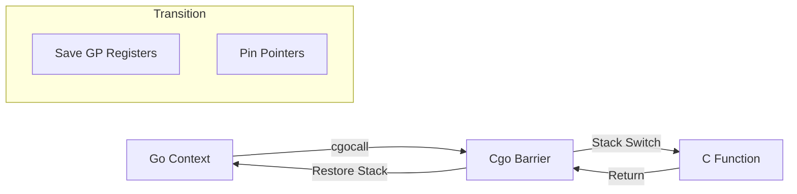

# CH-01: Cgo Barrier (Foreign Function Interface)

> **Source Link**: [Go Packages: cgo](https://golang.org/cmd/cgo/) | [Go Runtime: Cgo Stack Handling](https://github.com/golang/go/blob/master/src/runtime/cgocall.go)

## 1. Konsep & Esensi (Definisi & Rasionalitas)

### Definisi ("Apa itu?")
Cgo Barrier adalah mekanisme transisi antara dunia Go (yang memiliki GC, stack dinamis, dan scheduler) dan dunia C (yang memiliki stack statis dan manual memory management).

### Rasionalitas ("Why & How?")
1. **Interoperability**: Mengizinkan Go memanfaatkan library C yang sudah matang (seperti SQLite, libcurl).
2. **Stack Switching**: Go harus memindahkan eksekusi dari stack Goroutine (2KB) ke stack thread OS reguler (2MB) saat memanggil fungsi C agar tidak terjadi overflow.
3. **Pointer Safety**: Menjamin bahwa GC Go tidak memindahkan data yang sedang diproses oleh fungsi C (*Pointer Pinning*).

### Analogi Model Mental
Bayangkan **Gerbang Perbatasan Negara**.
Go adalah **Negara A** (Modern, otomatis) dan C adalah **Negara B** (Tradisional, manual). Saat Anda (Data) menyeberang, Anda harus melewati **Pintu Tol (Cgo Barrier)**. Di sini, paspor Anda diperiksa, kendaraan Anda diganti agar sesuai aturan jalan di Negara B, dan ada jaminan bahwa Anda tidak akan "diambil" oleh petugas kebersihan (GC) Negara A selama berada di luar negeri.

---

## 2. Visualisasi Sistem (Mermaid)

---

## 3. Mekanisme Pembuktian (Algoritma Detil)
Setiap pemanggilan Cgo melibatkan *overhead* yang cukup besar (runtime overhead sekitar 50-200ns) karena proses pemindahan stack dan registrasi pointer ke GC. Go menggunakan "trampoline" untuk melompat dari runtime Go ke kode C. Hindari pemanggilan Cgo dalam loop ketat karena akan menurunkan performa secara drastis dibandingkan kode murni Go.

---

## 4. Lab Praktis (Examples)
Silakan tinjau folder [examples/](./examples) untuk eksperimen berikut:
- `01_simple_cgo.go`: Pemanggilan fungsi matematika C sederhana dari Go.
- `02_pointer_passing.go`: Demonstrasi aturan aman melempar pointer Go ke dalam C.

---
*Unit ini memenuhi standar Platinum Gold (PPM V4).*
