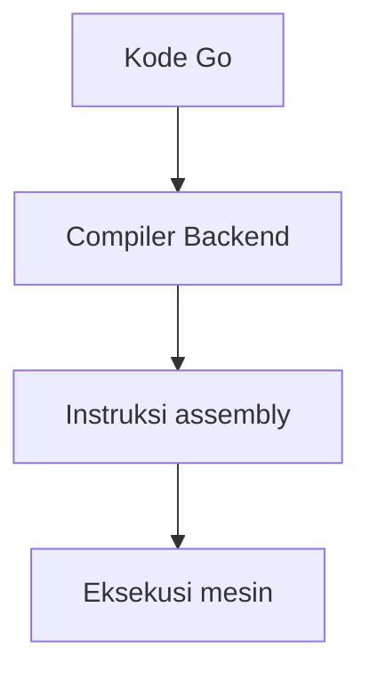

# CH-02: Go Assembly

> **Source Link**: [cmd/compile](https://pkg.go.dev/cmd/compile) | [A Quick Guide to Go's Assembler](https://go.dev/doc/asm)

## Tahap 1: Konsep dan Intuisi

### Apa itu?
Go assembly dalam konteks chapter ini berarti melihat bentuk instruksi rendah yang dihasilkan compiler dari kode Go. Tujuannya bukan supaya semua pembaca menulis assembly manual, tetapi supaya kita bisa membaca konsekuensi mesin dari kode yang kita tulis.

### Kenapa ini penting?
Ada situasi di mana melihat assembly membantu:
- memahami apakah fungsi terlalu kompleks untuk optimisasi tertentu;
- melihat biaya call, bounds check, atau operasi sederhana;
- menghubungkan konsep compiler backend dengan hasil konkret.

### Analogi singkat
Kalau kode Go adalah resep, assembly adalah daftar gerakan tangan yang benar-benar dilakukan koki di dapur. Resepnya tetap penting, tapi kadang kita perlu melihat gerakan nyatanya untuk paham biaya dan urutannya.

## Tahap 2: Visualisasi Sistem

## Tahap 3: Mekanisme Internal

Compiler Go melewati beberapa tahap sebelum sampai ke instruksi akhir. Chapter ini fokus pada tahap paling akhir yang terlihat oleh pembaca: keluaran assembly dari fungsi Go biasa.

Yang penting dipahami:
- assembly yang kita lihat adalah hasil keputusan backend compiler;
- bentuk akhirnya bisa bergantung pada arsitektur target;
- tujuan inspeksi assembly adalah memahami konsekuensi, bukan menghafal semua opcode.

## Tahap 4: Lab Praktis

Lihat folder [examples/](./examples) untuk percobaan berikut:
- `01_compile_to_assembly.go`: fungsi kecil yang bisa dipakai sebagai titik awal untuk inspeksi assembly dengan `go tool compile -S` atau `go build -gcflags=-S`.

## Tahap 5: Ringkasan Praktis

- Assembly membantu kita melihat hasil akhir dari pipeline backend compiler.
- Nilai utamanya ada pada observasi biaya dan bentuk instruksi, bukan pada romantisasi low-level coding.
- Untuk sebagian besar kode Go, membaca assembly adalah alat diagnosis, bukan workflow harian.

---
*Status: [x] Complete*
