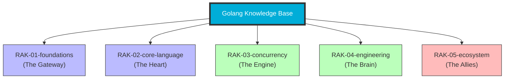

# Golang Knowledge Base

> **"Membangun Sistem yang Presisi, Efisien, dan Scalable dengan Kekuatan Gopher."**

## Latar Belakang & Visi
Dalam dunia pengembangan software, seringkali kita terjebak dalam kompleksitas yang berlebihan. Bahasa yang terlalu fleksibel terkadang membuat kode sulit dipelihara, sementara bahasa yang terlalu kaku memperlambat inovasi.

**Golang Knowledge Base** adalah manifestasi dari filosofi Go: **Simplicity is the key to scaling**. Saya mendekomposisi documentation Go yang formal menjadi unit-unit kecil yang manusiawi menggunakan analogi **Pabrik Gopher (The Gopher Factory)**. Di sini, kita belajar bagaimana membangun mesin yang presisi—di mana setiap komponen memiliki tujuan yang jelas dan bekerja secara harmonis, terutama dalam menangani konkurensi.

## Tujuan (Objectives)
1. **Portofolio**: Menunjukkan kedalaman teknis dalam menguasai bahasa sistem modern dan konkurensi.
2. **Catatan Belajar Personal**: Dokumentasi perjalanan dari pengembang fungsional/OOP menjadi Go Architect.
3. **Shareable Resource**: Referensi terpercaya untuk memahami konsep sulit (seperti Channels, Context, atau Memory Management).
4. **Living Documentation**: Selalu diperbarui mengikuti rilis terbaru dari tim Go.

## Mengenal Golang: "The Precision Machine" 🐹
Go bukan sekadar bahasa pemrograman; Go adalah cara berpikir. Didesain untuk menyelesaikan masalah di Google pada skala besar, Go mengutamakan keterbacaan, kecepatan kompilasi, dan performa runtime.

### 🎭 Analogi: "Pabrik Gopher & Ban Berjalan (Conveyor Belt)"
Bayangkan aplikasi Anda adalah sebuah **Pabrik Raksasa**.
- **Goroutines** adalah **Pekerja Gopher** yang sangat ringan. Anda bisa memiliki ribuan pekerja di satu ruangan tanpa membuat pabrik itu runtuh.
- **Channels** adalah **Ban Berjalan (Conveyor Belt)**. Pekerja tidak perlu berteriak (berbagi memori) untuk berkomunikasi; mereka cukup meletakkan barang (data) di ban berjalan dan pekerja lain akan mengambilnya.
- **Interfaces** adalah **Soket Standar**. Selama mesin Anda memiliki colokan yang pas, Anda bisa memasangnya ke sistem pabrik tanpa memperdulikan merek mesin tersebut.

Go mentransformasi pengembangan sistem yang "rumit dan lambat" menjadi proses yang "simpel dan efisien".

### 🚀 Mengapa Menggunakan Go?
1.  **Konkurensi Kelas Satu**: Fitur `goroutines` dan `channels` membuat pemrograman asinkron menjadi sangat natural dan aman.
2.  **Kompilasi Cepat**: Go dirancang untuk dikompilasi secepat kilat, meningkatkan produktivitas pengembang secara dramatis.
3.  **Static Binary**: Hasil akhirnya adalah satu file binary mandiri yang tidak butuh runtime tambahan di server (Zero-dependency deployment).
4.  **Standard Library yang Kuat**: "Batteries included". Anda bisa membuat web server, parser JSON, hingga klien gRPC hanya dengan modul bawaan.

---

## Struktur Perpustakaan (5-Rack Architecture)
Repositori ini menggunakan standar **PPM (Perpustakaan Pribadi Modular)** dengan hierarki:
**Rak -> Sub-Rak -> Buku -> Bab -> Section.**

---

## Roadmap & Status Pengembangan (Draft Plan)

| Rak | Deskripsi | Status |
| :--- | :--- | :--- |
| `RAK-01-foundations/` | Intro, Syntax, Tutorial, & First Principles | *Planned* |
| `RAK-02-core-language/` | Logic, Data Structures, Abstraction, & Errors | *Planned* |
| `RAK-03-concurrency/` | Goroutines, Channels, Context, & Sync | *Planned* |
| `RAK-04-engineering/` | Tooling (go mod, test), Profiling, & Layout | *Planned* |
| `RAK-05-ecosystem/` | Std Lib (HTTP, SQL), Serialization, & Releases | *Planned* |

## Visi Aktif
Repositori ini bertindak sebagai **"The Gopher Factory"** dalam *Master Plan: Polyglot Senior Architect*. Fokus materi murni pada **Golang Language & Tooling**.

---
*Dokumentasi Lengkap & Roadmap: [docs/README.md](./docs/README.md)*
*Panduan Struktur & Standar: [docs/standards/architecture.md](./docs/standards/architecture.md)*