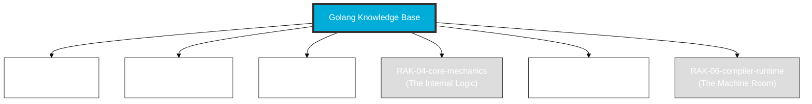

# Golang Knowledge Base

> **"Mastering Go: From Simple Syntax to Cloud-Native Scale."**

## 🏛️ Arsitektur 6-Rak (Universal Standard)
Repositori ini menggunakan **6-Rack Universal Architecture** dengan prinsip **Digital Mirroring** untuk memisahkan antara fondasi penggunaan dengan dekonstruksi arsitektur mesin.

---

## 🗄️ Struktur Perpustakaan

### 1. [RAK-01-anatomy](./RAK-01-anatomy/)
Menelusuri esensi naratif Go, filosofi "Less is More", dan target utamanya.

### 2. [RAK-02-foundation](./RAK-02-foundation/)
Sintaks dasar dan eksekusi instruksi Go bersumber dari dokumentasi resmi.

### 3. [RAK-03-evolution](./RAK-03-evolution/)
Mendokumentasikan evolusi spesifikasi, migrasi rilis, dan pergeseran generasi.

### 4. [RAK-04-core-mechanics](./RAK-04-core-mechanics/)
Mekanika Paling Mendalam: error handling, pointer, interface, dan channels.

### 5. [RAK-05-standard-library](./RAK-05-standard-library/)
Eksplorasi Runtime Environment: paket bawaan `net/http`, `fmt`, `sync`, dll.

### 6. [RAK-06-compiler-runtime](./RAK-06-compiler-runtime/)
Deep dive mutlak ke ruang mesin: Go compiler, Goroutine Scheduler (M:P:G), dan Garbage Collection.

---

## 📏 Standar Kualitas (Gold Standard)
Setiap materi mengikuti prinsip **Digital Mirroring** dan standar **PPM V4** yang mewajibkan:
1. **Source-Synced**: Akurasi 1:1 terhadap dokumentasi resmi/spesifikasi.
2. **Experimental Lab**: Kode pembuktian fungsional di folder `examples/`.
3. **Mental Model Visual**: Diagram Mermaid di folder `assets/`.
4. **Narrative Excellence**: Penjelasan mendalam dengan analogi dunia nyata.

*Dokumentasi Lengkap Standar: [docs/standards/architecture.md](./docs/standards/architecture.md)*

---
*Status Pengembangan: [status.md](./status.md)*