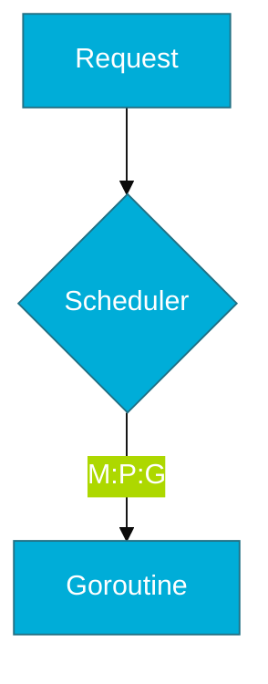

# Panduan Estetika Visual (Go Edition)

Mencerminkan efisiensi, skalabilitas, dan ketangguhan sistem cloud-native.

## 1. Skema Warna (Branding)
- **Primary Color**: `#00ADD8` (Go Blue / Gopher Blue).
- **Secondary Color**: `#000000` (Classic Black).
- **Action Color**: `#5DC9E1` (Light Blue - for contrast).

## 2. Standar Mermaid
Diagram harus terlihat terstruktur, paralel, dan efisien:

## 3. Simbol Visual
- **Gopher**: Mewakili **Runtime & Kerja Paralel**.
- **Warna Biru**: Digunakan untuk elemen yang bersifat *concurrent/fast*.
- **Warna Abu-abu**: Digunakan untuk operasi *Blocking/I/O* (sebelum dipindah ke Netpoller).
- **Warna Transparan/Dotted**: Digunakan untuk representasi *Memory Allocation (Heap vs Stack)*.
