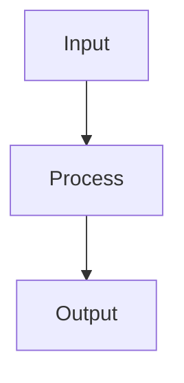

# Template: Chapter atau Section README

Gunakan struktur berikut untuk setiap unit `CH` atau `SEC` baru:

1. `# [JUDUL UNIT]`
2. `> **Source Link**: ...`
3. `## 1. Tahap 1: Source Alignment dan Judul`
4. `## 2. Tahap 2: Konsep dan Rasionalitas`
5. `## 3. Tahap 3: Visualisasi Sistem`
6. `## 4. Tahap 4: Mekanisme Pembuktian`
7. `## 5. Tahap 5: Lab Praktis`
8. `*Status: [ ] Draft*`

## Contoh Kerangka

````md
# [JUDUL UNIT]

> **Source Link**: [Sumber resmi](https://example.com)

## 1. Tahap 1: Source Alignment dan Judul
- Judul unit dan framing singkat.
- Tautan ke sumber resmi yang relevan.

## 2. Tahap 2: Konsep dan Rasionalitas

### Definisi
[Definisi formal konsep.]

### Rasionalitas
[Mengapa fitur ini ada, masalah apa yang diselesaikan, dan bagaimana ia dipahami.]

### Analogi Model Mental
[Analogi yang membantu pembaca memahami mekanismenya.]

### Terminologi Teknis
- **Term 1**: Penjelasan
- **Term 2**: Penjelasan

## 3. Tahap 3: Visualisasi Sistem



## 4. Tahap 4: Mekanisme Pembuktian
[Penjelasan under-the-hood, runtime, compiler, memory, atau algoritma.]

## 5. Tahap 5: Lab Praktis
- [01_example.go](./examples/01_example.go) - Penjelasan singkat.

---
*Status: [ ] Draft*
````

## Catatan Nil Content

Untuk unit naratif murni:
- hapus Tahap 3 dan Tahap 5 bila memang tidak relevan;
- tambahkan penafian eksplisit;
- jangan buat `assets/` atau `examples/` kosong.
